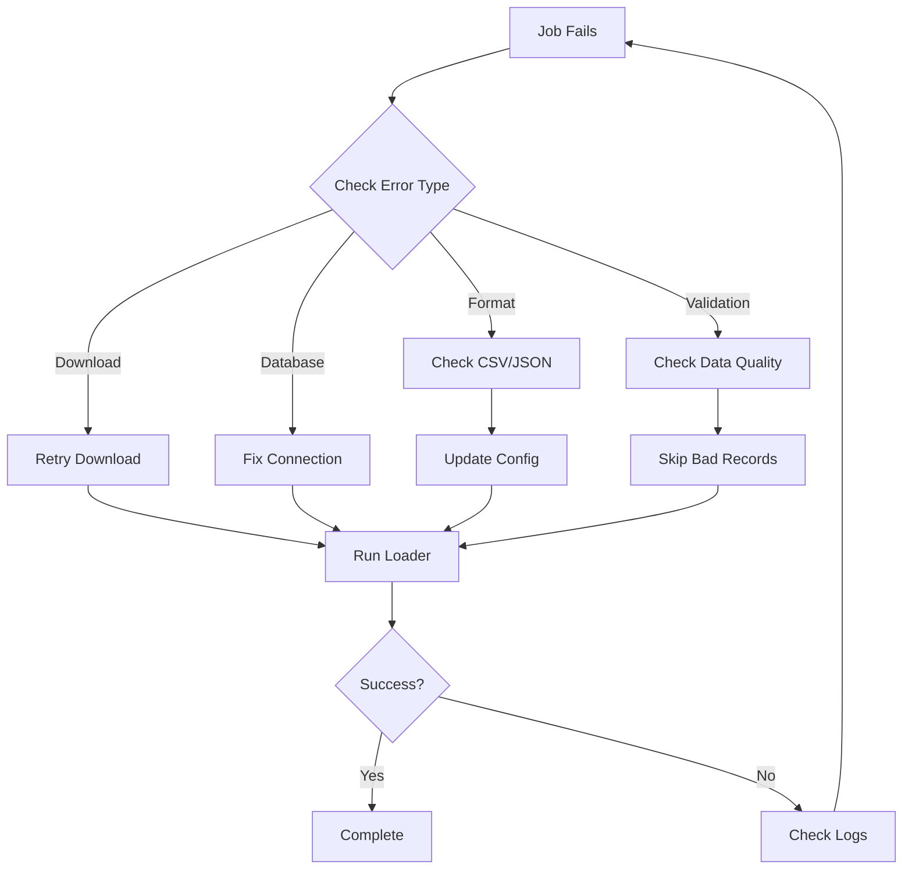

# Error Handling Guide - Iowa Asbestos Licenses Loader

## Overview

This guide provides error handling procedures for the Iowa Asbestos Licenses Loader. The dataset is relatively small (~2,600 records), making recovery quick and straightforward.

## Common Error Types and Solutions

### 1. Data Download Errors

**Symptoms:**
```
curl: (7) Failed to connect to data.iowa.gov port 443
HTTP 503 Service Unavailable
```

**Resolution:**
```bash
# 1. Check internet connection
ping -c 3 data.iowa.gov

# 2. Try alternative download method (API)
curl -o data/asbestos_licenses.json \
  "https://data.iowa.gov/resource/c9cg-ivvu.json?\$limit=3000"

# 3. Manual download
# Visit: https://data.iowa.gov/Workforce/Active-Iowa-Asbestos-Licenses/c9cg-ivvu
# Click: Export → CSV
# Save to: data/Active_Iowa_Asbestos_Licenses_YYYYMMDD.csv

# 4. Verify download
ls -lh data/*.csv
wc -l data/*.csv  # Should be ~2,600 lines
```

### 2. Data Format Errors

**Symptoms:**
```
KeyError: 'First Name'
ValueError: Invalid date format
```

**Resolution:**
```bash
# 1. Check file format (CSV vs JSON)
head -5 data/Active_Iowa_Asbestos_Licenses_*.csv

# 2. Verify column headers match expected
python3 -c "
import csv
with open('data/Active_Iowa_Asbestos_Licenses_20251002.csv', 'r') as f:
    reader = csv.reader(f)
    headers = next(reader)
    print('Headers:', headers)
    print('Expected: FolderRSN, Registration Number, License Type, First Name, Last Name, County, Issue Date, Expire Date')
"

# 3. If format changed, update field mappings in config
vim config/iowa_asbestos_loader.yaml
# Update field_mappings section

# 4. Retry with updated config
./scripts/run_asbestos_loader.sh --test
```

### 3. Name Validation Errors

**Symptoms:**
```
Validation errors: ['Missing person name']
Records with empty names
```

**Resolution:**
```python
# 1. Check for records with missing names
import csv

with open('data/Active_Iowa_Asbestos_Licenses_20251002.csv', 'r') as f:
    reader = csv.DictReader(f)
    missing_names = []
    for i, row in enumerate(reader, 1):
        if not row.get('First Name') or not row.get('Last Name'):
            missing_names.append((i, row))
    
    if missing_names:
        print(f"Found {len(missing_names)} records with missing names:")
        for line_num, record in missing_names[:5]:
            print(f"  Line {line_num}: {record}")

# 2. These records will be skipped automatically
# Check skipped count in loader output
```

### 4. License Type Validation

**Symptoms:**
```
WARNING: Unknown license type: Supervisor
Expected: Worker, Inspector, Contractor/Supervisor, Management Planner, Project Designer
```

**Resolution:**
```sql
-- 1. Check actual license types in data
SELECT DISTINCT attribute_value, COUNT(*) 
FROM attributes 
WHERE attribute_type = 'asbestos_license_type'
GROUP BY attribute_value
ORDER BY COUNT(*) DESC;

-- 2. If new types found, update config
-- Edit config/iowa_asbestos_loader.yaml
-- Add new types to entity_detection.license_types

-- 3. Warnings don't stop processing
-- Records are still imported with the actual license type
```

### 5. Duplicate Person Detection

**Symptoms:**
```
Person already exists with same name
Multiple licenses for same person
```

**Resolution:**
```sql
-- 1. Check for duplicate persons
SELECT primary_name, COUNT(*) as count
FROM nodes
WHERE node_type = 'Person'
  AND EXISTS (
    SELECT 1 FROM attributes a
    WHERE a.node_id = nodes.node_id
      AND a.attribute_type = 'asbestos_license_type'
  )
GROUP BY primary_name
HAVING COUNT(*) > 1
ORDER BY count DESC;

-- 2. System handles duplicates by deduplication
-- Same person with multiple licenses will be merged

-- 3. Check person's licenses
SELECT n.primary_name, a.attribute_type, a.attribute_value
FROM nodes n
JOIN attributes a ON n.node_id = a.node_id
WHERE n.primary_name = 'JOHN SMITH'
  AND a.attribute_type LIKE '%license%'
ORDER BY a.attribute_type;
```

### 6. Date Format Errors

**Symptoms:**
```
Invalid date format for issue_date: 05/15/2023
Expected format: YYYY-MM-DD
```

**Resolution:**
```python
# The loader handles multiple date formats
# If new format encountered:

# 1. Check actual date format in file
import csv
from collections import Counter

date_formats = Counter()
with open('data/Active_Iowa_Asbestos_Licenses_20251002.csv', 'r') as f:
    reader = csv.DictReader(f)
    for row in reader:
        if row.get('Issue Date'):
            # Check format
            if '/' in row['Issue Date']:
                date_formats['MM/DD/YYYY'] += 1
            elif '-' in row['Issue Date']:
                date_formats['YYYY-MM-DD'] += 1
            elif 'T' in row['Issue Date']:
                date_formats['ISO8601'] += 1

print("Date formats found:", date_formats)

# 2. Loader auto-handles these formats:
# - YYYY-MM-DD
# - MM/DD/YYYY  
# - ISO8601 (2023-05-15T00:00:00.000)
```

### 7. Small Dataset Advantages

Since the dataset is small (~2,600 records):

```bash
# Quick full reload (if issues)
# 1. Clear previous attempt (optional)
psql -h $DB_HOST -U $DB_USER -d graph_db << SQL
UPDATE sources
SET status = 'superseded'
WHERE source_type = 'iowa_asbestos_database'
  AND status = 'processing';
SQL

# 2. Run full load (takes ~5 minutes)
./scripts/run_asbestos_loader.sh

# 3. Or test with subset first
./scripts/run_asbestos_loader.sh --test  # 100 records
```

## Recovery Workflow



## Monitoring Commands

### Check Progress
```bash
# Real-time monitoring
watch -n 5 'tail -20 logs/asbestos_loader_*.log | grep -E "Processed|ERROR"'

# Database status
psql -h $DB_HOST -U $DB_USER -d graph_db -c "
SELECT status, records_processed, records_imported, 
       NOW() - updated_at as last_update
FROM sources
WHERE source_type = 'iowa_asbestos_database'
ORDER BY created_at DESC LIMIT 1"
```

### Verify Results
```sql
-- Count imported persons
SELECT COUNT(DISTINCT node_id) as licensed_persons
FROM attributes
WHERE attribute_type = 'asbestos_license_type';

-- License distribution
SELECT attribute_value, COUNT(*) 
FROM attributes
WHERE attribute_type = 'asbestos_license_type'
GROUP BY attribute_value;

-- Check name parsing
SELECT 
    COUNT(*) FILTER (WHERE attribute_type = 'computed_first_name') as with_first,
    COUNT(*) FILTER (WHERE attribute_type = 'computed_surname') as with_last
FROM attributes
WHERE node_id IN (
    SELECT node_id FROM attributes 
    WHERE attribute_type = 'asbestos_license_type'
);
```

## Prevention Best Practices

1. **Always Download Fresh Data**
   ```bash
   ./scripts/download_data.sh --format csv
   ```

2. **Test First**
   ```bash
   ./scripts/run_asbestos_loader.sh --test
   ```

3. **Monitor First 100 Records**
   - Check for validation errors
   - Verify license types
   - Confirm date parsing

4. **Small Dataset = Quick Recovery**
   - Full reload takes ~5 minutes
   - No need for complex recovery
   - Can afford to start fresh if needed

## Getting Help

If errors persist:

1. Check logs:
   ```bash
   grep -i error logs/asbestos_loader_*.log | tail -20
   ```

2. Verify data source:
   - https://data.iowa.gov/Workforce/Active-Iowa-Asbestos-Licenses/c9cg-ivvu
   - Check "Last Update" date
   - Verify column names haven't changed

3. Test with curl:
   ```bash
   # Get one record to test
   curl "https://data.iowa.gov/resource/c9cg-ivvu.json?\$limit=1" | python3 -m json.tool
   ```